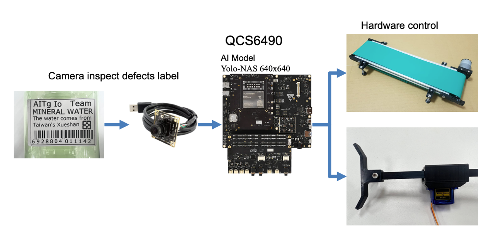

# Qualcomm QCS6490 Edge AI Label Defects Detection

## Advantages of QCS6490

1. QCS6490 can provide up to 12 TOPS of AI computing power and supports GPU and DSP accelerated computing
2. The Qualcomm Neural Processing (SNPE) SDK and the Qualcomm AI Engine Direct (QNN) can optimize the performance of trained neural networks
3. It supports Yocto, Ubuntu, Android, and Windows for AI development

## Performance Metrics

- **AI Model**: Yolo-NAS
- **System Performance**: 8~14 FPS

## Hardware

- **Platform**: [Qualcomm QCS6490](https://www.qualcomm.com/internet-of-things/products/q6-series/qcs6490)
- **Camera**: USB Camera

## Software & Toolkit

- **AI SDK (SNPE):** v2.14
- **System:** Android

## Background & Solution

### Motivation

To solve the defective label issue in the production line

### Solution

Using AI technology to detect and remove defects from the production line

## Architecture Diagram

QCS6490 detects a defect in the product label, it stops the conveyor belt motor and activates a pusher to remove the defective product label from the production line

## Demo
https://github.com/user-attachments/assets/d4f8f570-75b7-4f5e-8aeb-87dd6bbd864e

